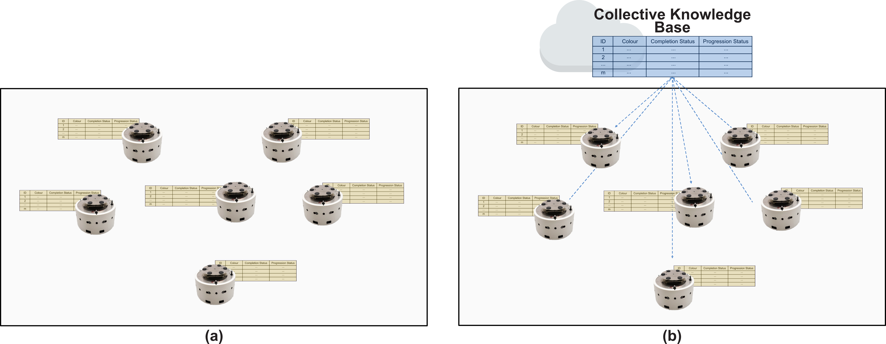
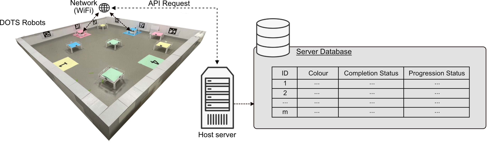

# Chapter 4 — Global Information Sharing

**Aim**  
To assess the performance of introducing global information sharing into a traditionally distributed swarm, by systematically varying task and swarm parameters.

**Contributions**  
The main contributions of this chapter are the following:
- A performance assessment of swarm-wide, task-specific global information sharing, validated in both simulation and physical robot experiments;
- An exploration of how variations in swarm size, task complexity, and resource availability affect the impact of global information sharing, highlighting the challenges of maintaining swarm-like properties under a global architecture.

**Experiments**  

This chapter compares two different scenarios in a logistics-delivery task. (a) - information is stored locally on robots alone. (b) - information is stored on robots and shared globally to a cloud hosted knowledge base.

All information is stored as representations of a task-tracker, used to track the progress of the task.

Experiments were completed in simulation and on the DOTS robot platform.

The following simulation experiments were carried out:

| Experiment       | Parameter                  | Value                  |
|------------------|----------------------------|------------------------|
| **1. Swarm size** | Num robots                 | **1–20**               |
|                  | Num boxes per delivery pt. | 5                      |
|                  | Num delivery points        | 10                     |
| **2. Task resource** | Num robots              | 10                     |
|                  | Num boxes per delivery pt. | **1–10**               |
|                  | Num delivery points        | 10                     |
| **3. Task complexity** | Num robots            | 1–20                   |
|                  | Num boxes per delivery pt. | 5                      |
|                  | Num delivery points        | **5, 10, 20**          |
| **4. Scalability** | Num robots               | **20, 50, 100, 200**   |
|                  | Num boxes per delivery pt. | 5                      |
|                  | Num delivery points        | **5, 10, 20**          |

The following DOTS platform experiments were carried out:

| Experiment   | Parameter                  | Value |
|--------------|----------------------------|-------|
| **Swarm size** | Number of DOTS robots       | 1–5   |
|              | Num boxes per delivery point | 2     |
|              | Num delivery points          | 4     |

**Results**  